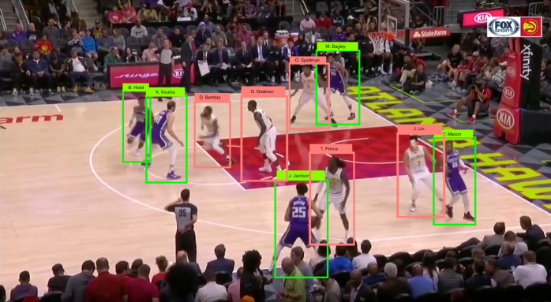
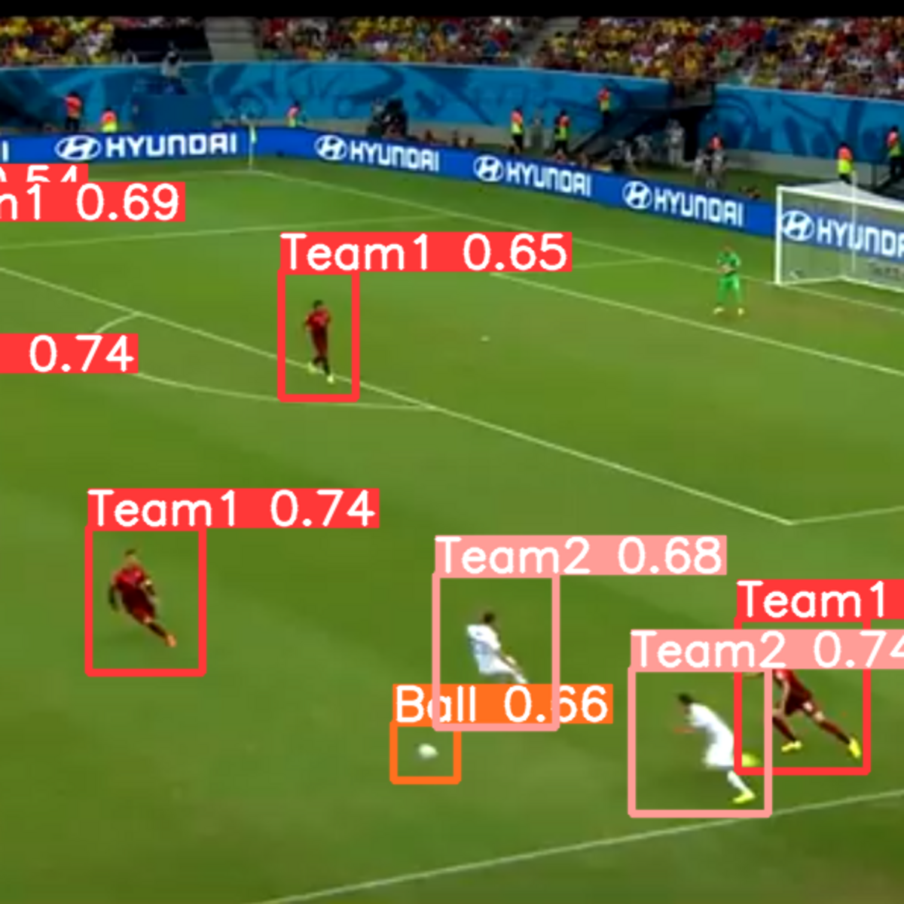
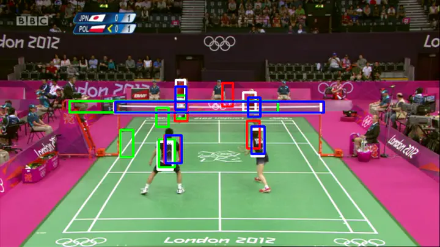

# 🏀 Project Orion – AI Sports Performance Assistant

Welcome to **Project Orion**, the next-generation **AI-powered sports performance platform** designed to enhance athlete performance, provide data-driven insights, and help sports teams elevate their game. By leveraging advanced machine learning algorithms and user-centric design, Orion empowers athletes, coaches, and teams to analyze gameplay, improve tactics, and achieve their performance goals.

Whether you're tracking physical metrics, analyzing your game strategies, or seeking expert advice, **Project Orion** provides all the tools you need in one seamless platform.

---

##  Features

### **AI Performance Insights**
Gain **in-depth analysis** of your gameplay performance. Orion's AI algorithms analyze key metrics such as speed, agility, stamina, and movement patterns to provide actionable insights and help you optimize your training routine.

### **Interactive Dashboard**
A **dynamic dashboard** that brings all your key stats to one place. With sleek, scrollable sections, users can explore:
- **Real-time game data**
- **Player performance tracking**
- **Game strategy breakdowns**
- **Key insights from training sessions**
- **Blog articles**, **testimonials**, and **ratings** from other athletes

### **AI Chatbot Assistant**
The **AI-powered chatbot** guides users through the platform, answering queries related to gameplay performance, suggesting training improvements, and directing users to additional resources.

### **Blog Section**
Stay updated with **cutting-edge sports research** and tips for improving performance. From physical fitness to recovery strategies, our expert-driven articles offer valuable content for athletes of all levels.

### **Testimonials & Awards**
Showcasing **real user feedback** and testimonials, along with Orion's achievements in the sports analytics space. Discover why top athletes trust Orion to maximize their performance.

### **FAQ Accordion**
Easily navigate common queries with an **interactive FAQ section**. Whether you're new to sports analytics or a seasoned pro, this section ensures you find the answers you need quickly.

### **Star Rating & Feedback Form**
Help us improve the platform by providing your **ratings** and detailed **feedback** on your experience. Your input is valuable and helps shape the future of Orion.

### **Secure Sign In & Sign Up**
A **secure authentication system** that allows users to sign in or create an account, ensuring personalized experiences while keeping your data safe.

---

## 📸 Screenshots

### **Landing Page**  
An engaging hero section with a clear call-to-action encouraging athletes to **explore the power of AI analytics**. A clean and intuitive layout to get started quickly.
<p align="center">
  
</p>

### **Testimonials & Why Choose Us**  
User testimonials and benefits of using Orion to improve athletic performance.
<p align="center">
  
</p>

### **Awards and Achievements**  
Highlighting Orion’s **contributions to sports science** with prestigious awards and recognitions.  
<p align="center">
  
</p>

### **Blog Section**  
Summaries of **cutting-edge sports research**, training tips, and expert advice to help athletes stay at the top of their game.
<p align="center">
  
</p>

### **AI Chatbot Assistant**  
The AI chatbot answers performance-related questions and offers helpful suggestions, ensuring athletes get personalized guidance in real-time.
<p align="center">
  
</p>

### **Star Rating & Feedback**  
Interactive components for collecting **user ratings** and **detailed feedback**, helping to enhance user experience.
<p align="center">
  
</p>

### **Sign In & Sign Up**  
Secure login and account creation with an **easy-to-use interface**, providing users with quick access to personalized features and saved data.  
<p align="center">
  
</p>  
<p align="center">
  
</p>

---

## 🖥️ Technologies Used

### **Frontend**  
- **Next.js 14 (App Router)**: A modern React framework providing server-side rendering, static site generation, and optimized routing for a faster and more dynamic user experience.
- **Tailwind CSS**: A utility-first CSS framework for rapid, responsive, and customizable UI development.
- **Lucide-react**: A collection of customizable icons designed for React applications.
- **TypeScript**: (optional but recommended) A statically typed superset of JavaScript that ensures enhanced type safety and developer productivity.

### **Backend**
- **Node.js**: A JavaScript runtime for building scalable server-side applications.
- **Express**: A minimal web framework for Node.js to handle routes, middleware, and API requests.

### **Database**
- **MongoDB**: A NoSQL database to store user data, performance metrics, and other dynamic content securely.
- **Firebase Authentication**: Provides secure authentication, including sign-in/sign-up and password reset functionalities.

---

## 🚀 Installation & Running Locally

### Prerequisites

- **Node.js v18+**: Install the latest LTS version of Node.js from [here](https://nodejs.org/).
- **npm** or **yarn**: Use npm (Node Package Manager) or yarn to manage packages and dependencies.

### Setup

1. **Clone the Repository**
   ```bash
   git clone https://github.com/your-username/project-orion.git
   cd project-orion
