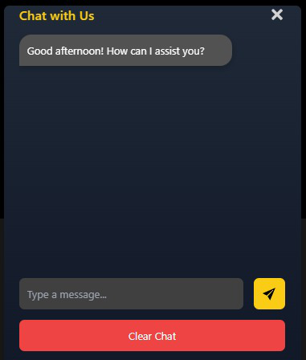

# Project Orion – AI Sports Performance Assistant 🚀

Welcome to **Project Orion**, an innovative AI-powered sports performance platform designed to elevate athletic performance, deliver data-driven insights, and empower sports teams to achieve new heights of excellence.

Built using cutting-edge web technologies and machine learning, **Project Orion** provides athletes, coaches, and sports scientists with actionable insights, advanced analytics, and intuitive tools for tracking and improving performance.

## 🌟 Key Features

| Feature                      | Description                                                                                     |
|-----------------------------|-------------------------------------------------------------------------------------------------|
| Real-Time Performance Insights | Analyze video and motion data in real time to deliver precise, personalized training recommendations. |
| Interactive Dashboard       | Real-time, interactive dashboard for tracking performance metrics and visualizing actionable insights. |
| AI Chatbot Assistant        | AI chatbot helps users navigate the platform and answer training-related/ other questions. |
| Blog Section                | Blog articles on sports science, injury recovery, nutrition, and AI in training.        |
| Testimonials & Awards       | Displays user testimonials and highlights recognitions received for innovation in sports tech.  |
| FAQ Accordion               | Clean accordion-style FAQ section for intuitive access to common questions.                     |
| Star Rating & Feedback      | Collects user feedback and ratings to help improve the platform.                                |
| SignIn/SignUp      | Firebase Authentication for secure sign-in with email/password.              |
 

## 📸 Screenshots

Below are some visuals showcasing various sections of the platform:

- **Dashboard**: Real-time performance tracking interface.
  

- **Testimonials**: Hear from athletes sharing their success stories.
  

- **Awards**: Recognitions and certifications for our innovative AI solutions.
  

- **Blog**: Interface for reading the latest sports science articles.
  

- **AI Chatbot**: User-friendly chatbot interface for real-time support.
  

- **FAQs**: Accordion-style FAQ for easy user navigation.
  

- **Feedback**: Feedback and rating section to improve platform usability.
  

- **Login**: Secure login interface for platform access.
  

- **Signup**: User registration interface for creating an account.
  

## ⚙️ Tech Stack

**Frontend:**
- **Next.js 14** – Optimized routing and performance using the latest features.
- **Tailwind CSS** – Utility-first CSS framework for building responsive, modern interfaces.
- **Lucide-react icons** – Lightweight and customizable icons to maintain a consistent UI.
- **TypeScript** – Strong typing and enhanced code safety (optional but recommended).

---

## 🚀 Getting Started

Clone the repository and get started with Project Orion:

1. Clone the repository:
   ```bash
   git clone https://github.com/yourusername/Project-Orion.git
